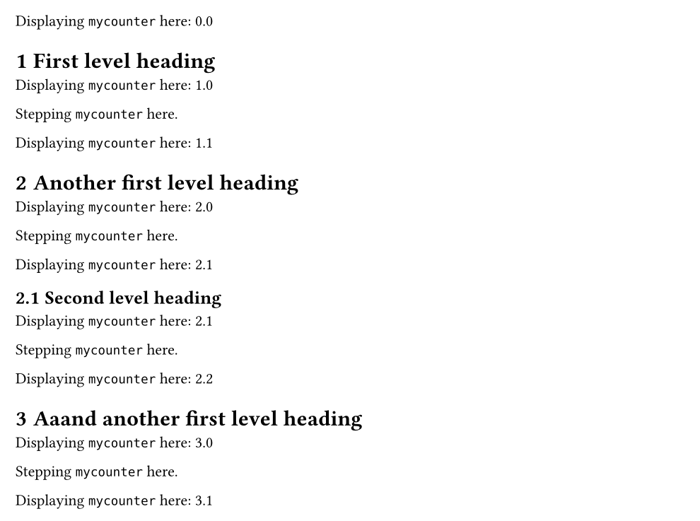

> [!NOTE]
> This is a [Typst](https://typst.app/) package. Click [here](https://typst.app/universe/package/rich-counters/) to find it in the Typst Universe.

# `rich-counters`

This package allows you to have **counters which depend on other counters**.

That means, the counter will _inherit_ one or more levels from another counter.

In the following example, the `mycounter` inherits the first level from `heading` (but not deeper levels).
```
#import "@preview/rich-counters:0.1.0": *

#set heading(numbering: "1.1")
#let mycounter = richcounter(identifier: "mycounter", inherited_levels: 1)

// DOCUMENT

Displaying `mycounter` here: #context (mycounter.display)("1.1")

= First level heading

Displaying `mycounter` here: #context (mycounter.display)("1.1")

Stepping `mycounter` here. #(mycounter.step)()

Displaying `mycounter` here: #context (mycounter.display)("1.1")

= Another first level heading

Displaying `mycounter` here: #context (mycounter.display)("1.1")

Stepping `mycounter` here. #(mycounter.step)()

Displaying `mycounter` here: #context (mycounter.display)("1.1")

== Second level heading

Displaying `mycounter` here: #context (mycounter.display)("1.1")

Stepping `mycounter` here. #(mycounter.step)()

Displaying `mycounter` here: #context (mycounter.display)("1.1")

= Aaand another first level heading

Displaying `mycounter` here: #context (mycounter.display)("1.1")

Stepping `mycounter` here. #(mycounter.step)()

Displaying `mycounter` here: #context (mycounter.display)("1.1")
```

